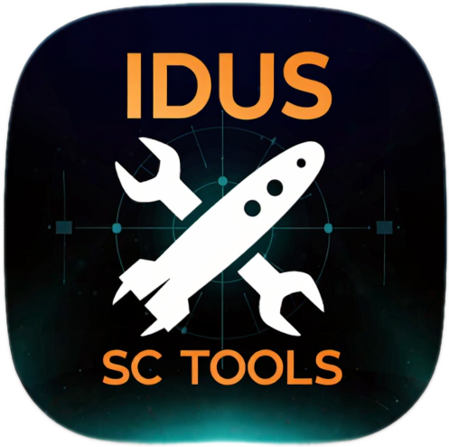

<div align="center">



# Idus SC Toolbox

**One-click fixes for running Star Citizen on Linux.**

A small GTK4 companion to the [LUG Helper](https://github.com/starcitizen-lug/lug-helper)
that handles the chores you otherwise redo by hand after every patch — killing a hung
client, backing up and restoring your keybinds, diagnosing HOTAS trouble, pinning the
launcher and game to the right screen, clearing the shader cache, and updating
[StarStrings](https://github.com/MrKraken/StarStrings).


</div>

<!-- Add a screenshot here once you have one:

-->

## Why

Star Citizen on Linux runs great via Wine/LUG — but each patch brings the same little
rituals: a client that won't die, keybinds that scramble when a joystick re-enumerates,
the launcher opening on the wrong monitor, stale shaders causing stutter. Idus SC Toolbox
puts all of those one click away, and keeps a backup so you can roll back when something
breaks mid-session.

## Requirements

- KDE Plasma 6 (Wayland or X11)
- Python + GTK4 bindings: `sudo pacman -S --needed python-gobject gtk4`
- A LUG-Helper install of Star Citizen (the Wine prefix is auto-detected from its config)

## Install

Download the three files (or grab them from [Releases](../../releases)), put them in one
folder, then run:

```bash
bash install-idus-sc-toolbox.sh
```

- The Wine **prefix is auto-detected** from `~/.config/starcitizen-lug/`.
  Wrong guess? Run: `SC_PREFIX=/your/path bash install-idus-sc-toolbox.sh`
- Backups default to `~/SC-backups`. Change with
  `SC_BACKUP_DIR="/path" bash install-idus-sc-toolbox.sh`
- Launch from the menu ("Idus SC Toolbox") or the terminal (`idus-sc-toolbox`).
- New icon not showing? Log out/in — the KDE icon cache is stubborn.

## What the buttons do

| Group | Button | Action |
|---|---|---|
| Close / clean | Kill SC + launcher + wineserver | `pkill` the game/launcher, then `wineserver -k` |
| | Restart launcher | Kill everything, then run LUG's `sc-launch.sh` |
| Config in Kate | USER.cfg / attributes.xml / actionmaps.xml / sc-launch.sh | Opens the file in Kate |
| | Game.log (follow live) | `tail -F` in Konsole |
| | Game folder in Dolphin | Opens the env folder |
| Backup | Back up now | Tars `user/` (keybinds, attributes), USER.cfg, sc-launch.sh → `~/SC-backups` |
| | Restore latest backup | Safety-copies current state, then unpacks the latest backup |
| | Auto-backup on launch | Takes one backup per day when the app starts |
| Joystick & windows | Joystick diagnostics | Lists devices, flags duplicate instances, shows what SC expects |
| | Fix windows now | One-shot: centre launcher + SC to main screen (KWin) |
| | Install KWin rule | Permanent rule pinning launcher + SC to the main screen |
| | Open Window Rules | Opens the KDE Window Rules settings |
| Shaders & audio | Clear shader cache | Deletes SC shader cache (optionally the GPU driver cache too) |
| | PipeWire quantum 2048 / Reset | Audio-stutter workaround |
| StarStrings | Update StarStrings (LIVE) | Downloads the latest [StarStrings](https://github.com/MrKraken/StarStrings) LIVE release, backs up the old english `global.ini` → `global.ini.BAK-[date]`, installs the new one |

### CLI

Every action has a flag, for KDE global shortcuts or a Stream Deck:

```bash
idus-sc-toolbox --kill | --fix-windows | --backup | --restore | --diag \
                --starstrings | --kwin-rule | --shaders [--driver-cache] \
                --quantum on|off | --env PTU | --screen N
```

## Notes & caveats

- **Window rules are machine-specific** — screen index, which monitor is primary and the
  resolution differ per setup. The generated rules are a starting point; adjust the
  `Screen` number in Window Rules if a window lands on the wrong monitor.
- **StarStrings also needs `USER.cfg`** (`g_language`) in the game root to take effect.
  The tool backs up and replaces the english `global.ini` only; it does not touch USER.cfg.
- The KWin rule descriptions start with "SC Toolbox" for backwards compatibility.
- Not affiliated with Cloud Imperium Games or the LUG. Use at your own risk — it ships a
  backup button for a reason. 🙂

## Uninstall

```bash
rm -f  ~/.local/bin/idus-sc-toolbox ~/.local/share/applications/idus-sc-toolbox.desktop
rm -rf ~/.local/share/idus-sc-toolbox ~/.local/share/icons/hicolor/512x512/apps/idus-sc-toolbox.png
```

## Support

Made by **Idus**. If this saved you time and you want to sponsor a new citizen,
use my Star Citizen referral code when you enlist — you get 5,000 free aUEC to start:

**`STAR-2GDF-FDKH`**
→ https://www.robertsspaceindustries.com/enlist?referral=STAR-2GDF-FDKH

Or buy me a coffee:

<a href='https://ko-fi.com/N4N2QZHKK' target='_blank'></a>

## License

MIT — see [LICENSE](LICENSE).

o7
